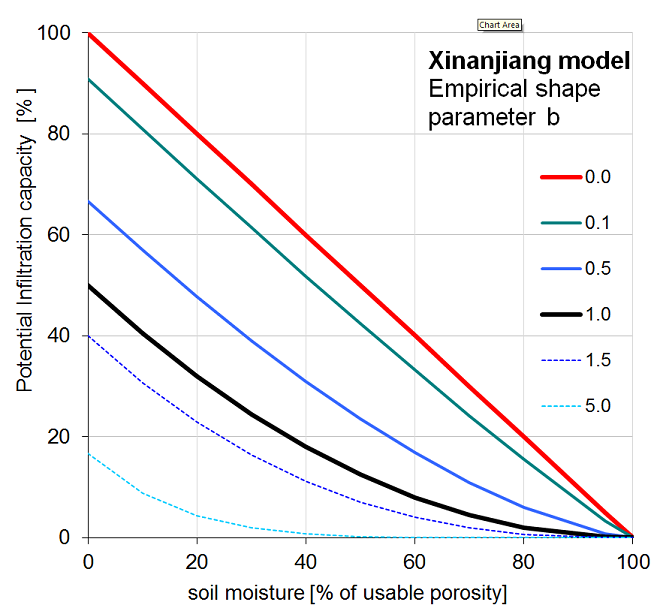

## Infiltration capacity

The infiltration capacity of the soil is estimated using the widely-used Xinanjiang (also known as VIC/ARNO) model (e.g. Zhao & Lui, 1995; Todini, 1996). This approach assumes that the fraction of a grid cell that is contributing to surface runoff (read: saturated) is related to the total amount of soil moisture, and that this relationship can be described through a non-linear distribution function. The **saturated fraction** $A_s$ of a pixel is approximated by the following distribution function:

$$
A_s = 1 - (1 - \frac{w_1}{w_{s1}})^b
$$

where $w_{s1}$ and $w_1$ are the maximum and actual amounts of moisture in the superficial (1a) and upper (1b) soil layers, respectively. Specifically, $$w_{s1} = w_{s1a} + w_{s1b}$$ and $$w_1 = w_{1a} + w_{1b}$$, all the values are in $[mm]. $b$ is an empirical non-dimensional shape parameter; its value is generally used as a calibration parameter. In LISFLOOD, $A_s$ is computed for the permeable fraction of each pixel (i.e. for the fraction $(1-d_{rf})$, meaning that the *direct runoff* is not considered in this computation). The **potential infiltration capacity** $INF_{pot} [mm]$ is a function of $w_{s1}$ and $A_s$:

$$
INF_{pot}= \frac{w_{s1}}{b +1} \cdot (1 - A_s)^{\frac{b + 1}{b}}
$$

Note that the shape parameter *b* is related to the heterogeneity within each grid cell. For a totally homogeneous grid cell *b* approaches zero, which reduces the above equations to a simple 'overflowing bucket' model. The latter statement means that **the infiltration process can fill all the soil usable capacity and surface runoff starts only upon the complete filling of the soil usable capacity. This condition is shown by the red line in the graph below: e.g. a soil of 60% soil moisture has 40% potential infiltration capacity. A $b$ value of 1.0 (black line in the graph below) is comparable to a leaking bucket : e.g. a soil of 60% soil moisture has only 10% potential infiltration capacity while 30% cannot infiltrate and it triggers surface runoff. When $b$ is larger than 1, the soil layer (including the superficial and upper layers) is comparable to a sieve as the soil matrix can hold a small amount of water (the potential infiltration capacity approaches 0 as can be seen in the dashed lines in the graph below) and the largest amount of water generates surface runoff.**

***Figure:*** *Soil moisture and potential infiltration capacity relation.*

The following Figure explains the soil behaviour as a function of the $b$ parameter according to the Xinanjiang model.

***Figure:*** *Analogy picture of increasing Xinanjiang empirical shape parameter* $b$.

[🔝](#top)
