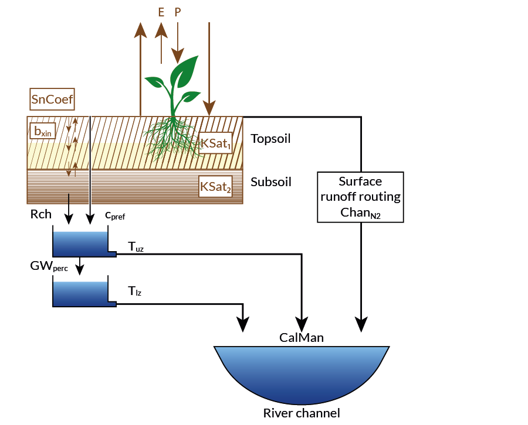

# Overview

The figure below provides a first overview on the processes included in LISFLOOD:

**Figure:** Overview  of the LISFLOOD model. $P$: precipitation; $E$:  evaporation & evapotranspiration; $SnCoef$: snow melt; $b_{xin}$: infiltration; $Chan_{N2}$: surface runoff; $GW_{perc}$: drainage from upper- to lower groundwater zone; $T_{uz}$: outflow from upper groundwater zone; $T_{lz}$: outflow from lower groundwater zone; $R_{ch}$: drainage from subsoil to upper groundwater zone; drainage from top- to subsoil; $C_{pref}$: preferential flow to upper groundwater zone.

 CINZIA or AD can you please check that the figure caption is correct - THANKS! Afterwards please delete this comment.
**

The standard setup of LISFLOOD simulates: snow melt, infiltration, interception of rainfall, leaf drainage, evaporation and water uptake by vegetation, surface runoff, preferential flow (bypass of soil layer), exchange of soil moisture between the two soil layers and drainage to the groundwater, sub-surface and groundwater flow, and flow through river channels. Each of these processes is described in more detail in the following sections.

