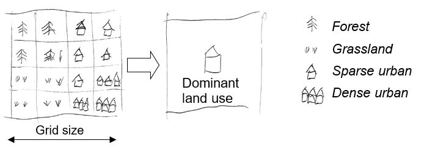
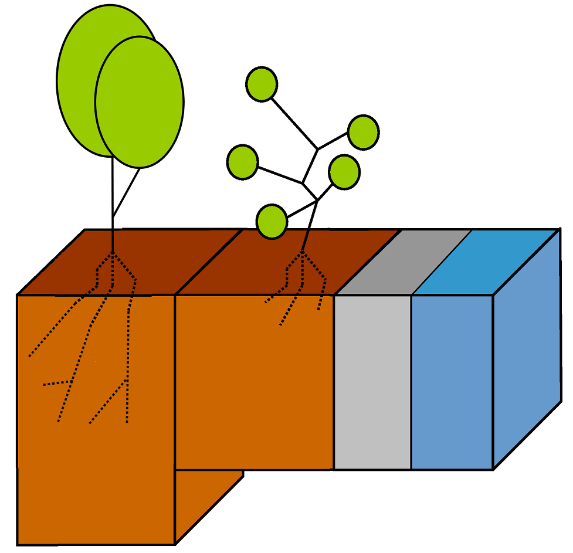

# Sub-grid variability

Before going into detail with the individual hydrological processes, here first some explaination on a larger conceptual approach on how LISFLOOD is dealing with sub-grid variability in land cover and the consecutive influence on various processes.

## Representation of land cover

In LISFLOOD a number of parameters are linked directly to land cover classes. In the past, this was done through lookup tables. The spatially dominant value has been used to assign the corresponding grid parameter values. This implies that some of the sub-grid variability in land use, and consequently in the parameter of interest, is lost (see Figure below).

**_Figure:_** Land cover aggregation approach in previous versions of LISFLOOD.

In order to account properly for land use dynamics, some conceptual changes have been made to render LISFLOOD more land-use sensitive. To account for the sub-grid variability in land use, we model the within-grid variability. In the latest version of the hydrological model, the spatial distribution and frequency of each class is defined as a percentage of the whole represented area of the new pixel. Combining land cover classes and modeling aggregated classes, is known as the concept of hydrological response units (HRU). The logic behind this approach is that the non-linear nature of the rainfall runoff processes on different land cover surfaces observed in reality will be better captured. This concept is also used in models such as SWAT (Arnold and Fohrer, 2005) and PREVAH (Viviroli et al., 2009). LISFLOOD has been transferred a HRU approach on sub-grid level, as shown here:

**_Figure:_** *LISFLOOD land cover aggregation by modelling aggregated land use classes separately: Percentages of forest (dark green); water (blue), impervious surface (red), other classes (light green).

## Soil model

If a part of a pixel is made up of built-up areas this will influence that pixel's water-balance. LISFLOOD's 'direct runoff fraction's parameter ($f_{dr}$) defines the fraction of a pixel that is impervious.
**For impervious areas**, LISFLOOD assumes that:

1. A depression storage is filled by precipitation and snowmelt and emptied by evaporation
2. Any water that is not filling the depression storage, reaches the surface is added directly to surface runoff
3. The storage capacity of the soil is zero (i.e. no soil moisture storage in the direct runoff fraction)
4. There is no groundwater storage

For open water (e.g. lakes, rivers) the water fraction parameter ($f_{water}$) defines the fraction that is covered with water (large lakes that are in direct connection with major river channels can be modelled using LISFLOOD's lake option, which is described in **Section XXXXXXXXXXXXXXXX**). **For water covered areas**, LISFLOOD assumes that:

1. The loss of actual evaporation is equal to the potential evaporation on open water
2. Any water that is not evaporated, reaches the surface is added directly to surface runoff
3. The storage capacity of the soil is zero (i.e. no soil moisture storage in the water fraction)
4. There is no groundwater storage

**For** the part of a pixel that is **forest** $(f_{forest})$ **or other land cover** $(f_{other}=1-f_{forest}-f_{dr}-f_{water})$ the description of all soil- and groundwater-related processes below (evaporation, transpiration, infiltration, preferential flow, soil moisture redistribution and groundwater flow) are valid. While the modelling structure for forest and other classes is the same, the difference is the use of different map sets for leaf area index, soil and soil hydraulic properties. Because of the nonlinear nature of the rainfall runoff processes this should yield better results than running the model with average parameter values. The table below summarises the profiles of the four individually modelled categories of land cover classes.

***Table:*** *Summary of hydrological properties of the four categories modelled individually in the modified version of LISFLOOD.*

| Category                                                     | Evapotranspiration                                           | Soil                                                      | Runoff                                                       |
| :----------------------------------------------------------- | :----------------------------------------------------------- | :-------------------------------------------------------- | :----------------------------------------------------------- |
| Forest                                                       | High level of evapo-transpiration (high Leaf area index) seasonally dependent | Large rooting depth                                       | Low concentration time                                       |
| Impervious surface                                           | Not applicable                                               | Not applicable                                            | Surface runoff but initial loss and depression storage, fast concentration time |
| Inland water                                                 | Maximum evaporation                                          | Not applicable                                            | Fast concentration time                                      |
| Other (agricultural areas, non-forested natural area, pervious surface of urban areas) | Evapotranspiration lower than for forest but still significant | Rooting depth lower than for forest but still significant | Medium concentration time                                    |

If you activate any of LISFLOOD's options for writing internal model fluxes to time series or maps (described in **Chapter XXXXXXXXXXXXXXXXXX**), the model will report the real fluxes, which are the fluxes multiplied by the corresponding fraction. The Figure below illustrates this for evapotranspiration (evaporation and transpiration) which calculated differently for each of this four aggregated classes. The total sum of evapotranspiration for a pixel is calculated by adding up the fluxes for each class multiplied by the fraction of each class.

***Figure:***  $ET_{forest} \to ET_{other} \to ET_{dr} \to ET_{water} $ *simulation of aggregated land cover classes in LISFLOOD.*

In this example, evapotranspiration (ET) is simulated for each aggregated class separately  $(ET_{forest}, ET_{dr}, ET_{water}, ET_{other}) $ As result of the soil model you get four different surface fluxes weighted by the corresponding fraction $(f_{dr},f_{water},f_{forest},f_{other})$, respectively two fluxes for the upper and lower groundwater zone and for groundwater loss also weighted by the corresponding fraction $(f_{forest},f_{other})$. However a lot of the internal flux or states (e.g. preferential flow for forested areas) can be written to disk as map or timeseries by activate LISFLOOD's options (described in **Chapter XXXXXXXXXXXXXXX**).

[🔝](#top)
