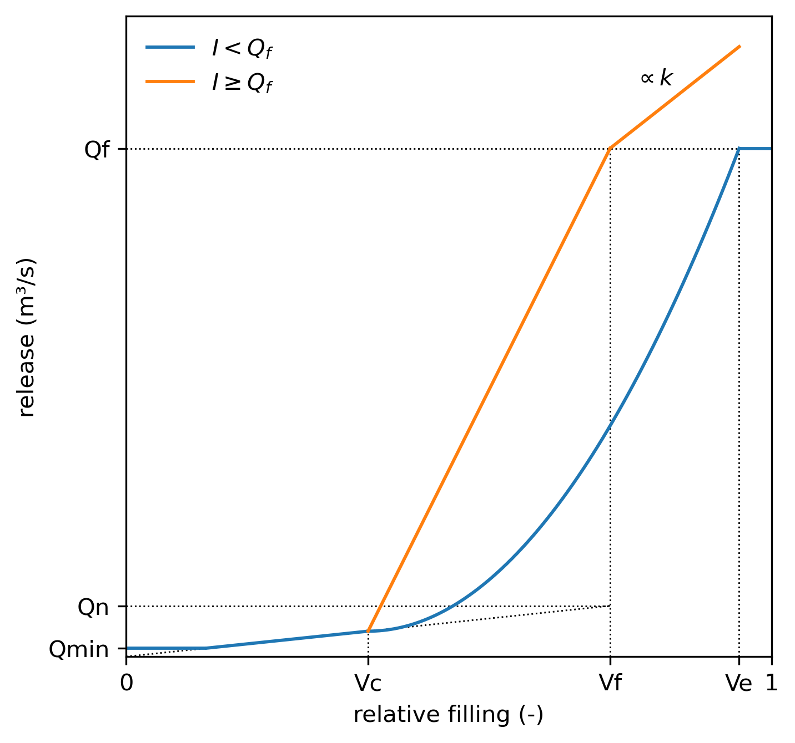

## Reservoirs

>**To add**. The reservoir routine extracts the inflow from all pixels upstream. Reservoirs can be placed in the outlet of the catchment, and do not need to be moved one pixel downstream.

### Introduction

This page describes the LISFLOOD reservoir routine, and how it is used.

### Description of the reservoir routine 

The LISFLOOD reservoir routine is, since version 5, an adaptaion of [Hanazaki et al. (2022)](https://agupubs.onlinelibrary.wiley.com/doi/full/10.1029/2021MS002944). In this routine, the reservoir release is a function of both the storage ($V_t$) and inflow ($I_t$) at the current time step.

As many other reservoir routines, it divides the reservoir storage capacity in several zones, and applies a different release rule to each of those zones. Specifically, this routine uses three storage values to define four storage zones: 
* A conservation zone, when the reservoir is in dry conditions ($V_t \leq V_c$). The conservation limit ($V_c$) is assumed as half of the flood limit.
$$V_c = 0.5 \cdot V_f$$
* A normal zone, where the reservoir should operate most of the time ($V_c \lt V_t \leq V_f$). The flood limit ($V_f$) is a calibration parameter; in the Hanazaki implementation, it is the 75% percentile of the observed storage time series.
* A flood zone, when the filling is high, but the reserovir is still safe ($V_f \lt V_t \leq V_e$).
* An emergency zone, when the reservoir is at risk of overtopping ($V_t \gt V_e$). The emergency limit ($V_e$) is assumed as the upper 20% of the storage above the flood limit.
$$V_e = S + 0.8 \cdot \left( S - V_f \right)$$
being $S$ the reservoir storage capacity.

Apart from the storage zone, the routine uses two characteristic release values:

* The minimum release ($Q_{min}$) or environmental flow.
* The normal release ($Q_n$) is the long-term average inflow ($\bar{I}$):
$$Q_n = \bar{I}$$
* The release associated with the flood outflow is a factor of the 100-year return period of inflow ($I_{100}$). The factor $\alpha$ is a calibration parameter; in the Hanazaki implementation it takes the default value of 0.30.
$$Q_f = \alpha \cdot I_{100}$$

The main difference between the Hanazaki model and the routine used in previous LISFLOOD versions is the addition of the reservoir inflow ($I_t$) as a condition on the release. If the inflow is smaller than a predefined flood discharge ($Q_f$), the release is a quadratic function of storage, so the reservoir stores water if in drier conditions. If the inflow exceeds the flood discharge, the release is a linear function of storage, therefore it is larger and prevents the reservoir from filling. 

The combination of those two conditions —storage and inflow— renders the following six release equations:

$$
Q_t =
\begin{cases}
\max \left( Q_n \frac{V_t}{V_f}, Q_{min} \right) & \text{if } V_t < V_c \\
Q_n \frac{V_c}{V_f} + \left( \frac{V_t - V_c}{V_e - V_c} \right)^2 \left( Q_f - Q_n \frac{V_c}{V_f} \right) & \text{if } I_t < Q_f \text{ and } V_c \leq V_t < V_e \\
Q_f & \text{if }  I_t < Q_f \text{ and } V_t \geq V_e  \\
Q_n \frac{V_c}{V_f} + \frac{V_t - V_c}{V_f - V_c} \left( Q_f - Q_n \frac{V_c}{V_f} \right) & \text{if } I_t \geq Q_f \text{ and }  V_c \leq V_t < V_f \\
Q_f + k \frac{V_t - V_f}{V_e - V_f} \left( I_t - Q_f \right) & \text{if } I_t \geq Q_f \text{ and } V_f \leq V_t < V_e  \\
I_t & \text{if } I_t \geq Q_f \text{ and } V_t \geq V_e
\end{cases}
$$

where $k$ is a release coefficient that modulates the release in the emergency zone when the flood inflow is exceeded. It is a function of catchment area ($A$ in m²) and flood volume (in m³), and it reflects the amount of average rainfall over the catchment that can be stored in the flood and emergency zones. If the reservoir is able to store 200 mm of rainfall, $k$ becomes zero and the emergency release is equal to the flood outflow. Larger values of $k$ indicate a smaller regulation capacity and larger releases.

$$k = \max \left(1 - \frac{1}{0.2} \cdot \frac{V_{tot} - V_f}{A}, 0 \right)$$

A visual representation of the routine can be seen in the figure below. The blue line represents the reservoir release under normal conditions, whereas the orange line the release in case of a flood event. For a given relative filling, the release is always smaller under normal conditions.



***Figure 1.** Scheme of the reservoir routine.*

### Input files

Reservoirs are simulated as points in the channel network. LISFLOOD needs a **map of the location of the dams** (NetCDF or PCRaster format) which defines their reservoir ID. This ID will be used to link each reservoir with its characteristics. In the routine, LISFLOOD will calculate the reservoir inflow as the channel flow in all pixels upstream of the reservoir.

The **three storage limits** and **two characteristic flows** need to be defined for each reservoir. They are provided as space-separated TXT files, where the first column indicates the reservoir ID and the second column the value of the attribute. For instance, the example below shows the table of flood limit (relative filling):

```txt
1 0.78
2 0.75
3 0.90
...
```

The functioning of the reservoirs can be adjusted by tuning two **reservoir parameters**: the flood limit ($V_f$) and the flood outflow factor ($\alpha$). The values of these parameters can be fed either as TXT files (as in the example above) or NetCDF maps.

The table below summarises the inputs required by the reservoir routine.

***Table 1.** Input requirements for the reservoir routine.*

| **Settings file** | **Type** | **Description** | **Default_name** | **Units** | **Remarks** |
|-------------------|----------|-----------------|------------------|-----------|-------------|
| `ReservoirSites`  | map      | Reservoir location and ID | *reservoirs.nc* | -  | Nominal   |
| `ReservoirTotalStorage`| table | Reservoir capacity | *res_storage.txt* | $m^3$ |           |
| `ReservoirFloodLimit` | map/table | Relative storage that defines the flood storage limit | *res_flood_limit.(txt/nc)* | - | Calibration parameter. Default value 0.75 |
| `ReservoirFloodOutflow` | table | Flood outflow | *res_flood_outflow.txt* | $\frac{m^3}{s}$ | 100-year return period of inflow |
| `ReservoirFloodOutflowFactor`| map/table | Modifier of the flood outflow | *res_outflow_factor.(txt/nc)* | - | Calibration parameter. Default value 0.30 |
| `ReservoirNormalOutflow` | table | Normal outflow | *res_normal_outflow.txt* | $\frac{m^3}{s}$ | Average inflow |
| `ReservoirMinOutflow` | table | Minimum outflow | *res_min_outflow_tx* | $\frac{m^3}{s}$ | Environmental flow |
| `ReservoirInitialFill` | map/table | Relative filling at the beginning of the simulation | -9999 | - | -9999 assumes 80% of the flood limit |
| `upAreaTrans` | map | Upstream area | *upArea.nc* | $m^2$ | Used to estimate the release coefficient $k$ |


### Output files

If the option `repsimulateReservoirs` is active (see Section [Settings](#Settings)), the reservoir routine produces 3 additional time series (TSS format) and one map, as listed in the following table:

***Table 2.** Outputs of the reservoir routine.*                    

| **Settings file** | **Format** | **Description** | **Default_name** | **Units** |
|-------------------|----------|-----------------|------------------|-----------|
| `ReservoirInfowTS` | TSS | Inflow time series | res_inflow.tss | $\frac{m^3}{s}$ |
| `ReservoirOutflowTS` | TSS | Outflow time series | res_outflow.tss | $\frac{m^3}{s}$ |
| `ReservoirFillTS` | TSS | Time series of reservoir filling | res_fill.tss | - |
| `ReservoirFillState` | NetCDF | Reservoir filling at the end of the simulation | res_fill.nc | - |

> **Note**. The map of reservoir filling at the end of a simulation can serve as the initial condition for a subsequent simulation by using the `ReservoirInitialFill` option (see Section [Settings](#Settings)).


### Settings

The reservoir routine is optional and can be activated with the `simulateReservoirs` option in the `lfoptions` section of the settings file in the settings file. To save the outputs of the reservoir simulation, activate the option `repsimulateReservoirs`.

```xml
<lfoptions>
    [...]
    <setoption choice="1" name="simulateReservoirs"/>
    <setoption choice="1" name="repsimulateReservoirs"/>
    [...]
</lfoptions>
```

The values of the two reservoir parameters and the reservoir initial condition are defined within the `lfuser` section of the settings file:

```xml
<lfuser>
    [...]
    <!--Reservoir model parameters-->
    <textvar name="ReservoirFloodStorage" value="$(PathMaps)/res_flood_limit.nc"/>
    <textvar name="ReservoirFloodOutflowFactor" value="$(PathMaps)/res_flood_outflow_factor.nc"/>
    
    <!--Reservoir initial condition-->
    <textvar name="ReservoirInitialFill" value="res_fill_19900102.nc">
        <comment>
            Initial reservoir fill fraction
            -9999 sets initial fill to normal storage limit
        </comment>
    </textvar>
    [...]
</lfuser>
```

The reservoir characteristics and the output files are defined in the `lfbinding` section of the settings file:

```xml
<lfbinding>
    [...]
    <!--Reservoir characteristics-->
    <textvar name="ReservoirSites" value="$(PathMaps)/reservoirs_Global_03min_new.nc"/>
    <textvar name="ReservoirTotalStorage" value="$(PathTables)/res_storage.txt"/>
    <textvar name="ReservoirFloodOutflow" value="$(PathTables)/res_100yr_inflow.txt"/>
    <textvar name="ReservoirNormalOutflow" value="$(PathTables)/res_avg_inflow.txt"/>
    <textvar name="ReservoirMinOutflow" value="$(PathTables)/res_min_outflow.txt"/>
    
    <!--Reservoir outputs-->
    <textvar name="ReservoirInflowTS" value="$(PathOut)/res_inflow.tss"/>
    <textvar name="ReservoirOutflowTS" value="$(PathOut)/res_outflow.tss"/>
    <textvar name="ReservoirFillTS" value="$(PathOut)/res_fill.tss"/>
    <textvar name="ReservoirStorageM3TS" value="$(PathOut)/res_storage.tss"/>
    <textvar name="ReservoirFillState" value="$(PathOut)/res_fill_20221231.nc"/>
    
</lfbinding>
```

[🔝](#top