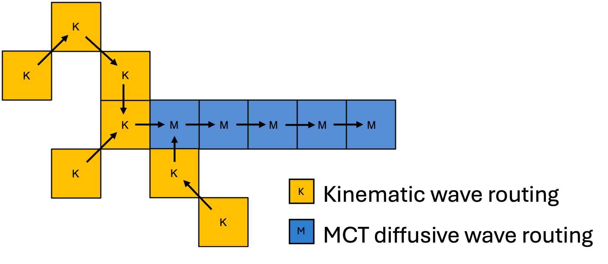

## Diffusive wave option (MCT)

### Introduction

This annex describes the LISFLOOD Muskingum-Cunge-Todini (MCT) channel routing option and how it is used. MCT wave routing is optional and can be activated by adding the following line to the ‘lfoptions’ element in the LISFLOOD XML settings file:

```xml
	<setoption name="MCTRouting" choice="1" />
```


### Background

Stream channel routing can be approached in two broad ways: (1) hydrologic and (2) hydraulic. The storage concept is the foundation for hydrologic stream channel routing. Flow routing in hydrological models is generally solved by taking into account a finite river reach and by solving directly for the outflow discharges as a function of the inflow ones, while all the geo-morphological characteristics and the hydraulic properties of the reach are lumped into a number of model parameters (Todini, 2007). On the other hand, mass and momentum conservation serve as the foundation for hydraulic channel routing. The dynamic wave is the most complete model of unsteady open channel flow. Kinematic and diffusion waves are convenient and practical approximations to the dynamic wave (Ponce, 1989).

The variable parameter Muskingum-Cunge wave routing method (MC) (Cunge, 1969) sits between hydrologic and hydraulic routing methods; it is similar in nature to hydrologic routing yet contains sufficient physical information to compare with the more complex hydraulic routing techniques. MC routing is obtained by transforming the kinematic wave equation into an equivalent diffusive wave equation by matching the physical diffusion to the numerical diffusion resulting from the imperfectly centred finite difference scheme (Tang and Samuels, 1999). The method accounts for both the convection and diffusion of the flood wave, making it an analogue of the diffusion wave with parsimonious implementation. Besides, the routing parameters can be linked to physical channel properties and flow characteristics and are recalculated every time step based upon channel properties and the flow depth (Todini, 2007). For this reason, the MC method is sometimes referred to as a “variable coefficient” method.

In recent years, a mass conservative modification of the MC equations was introduced by Todini 2007 to allow the MC to fully preserve the mass balance and, at the same time, to comply with the original Muskingum formulation in terms of water storage. The Muskingum-Cunge-Todini (MCT) wave routing method is a diffusion wave routing model that is simple and accurate enough to be suited for large-scale hydrologic modelling applications while preserving mass balance. The version of the MCT method presented by Reggiani et al. 2016 is available in LISFLOOD and its use is recommended in river reaches where the parabolic approximation holds. However, due to its one-dimensional nature, MCT routing cannot capture the dynamics of backwater effects (Shastry et al., 2019), which are significant elements of inland flow dynamics in coastal areas and can appear at the confluence of small tributaries into large rivers.

For a full description of the method and the relevant equations, the reader can refer to Todini, 2007, Reggiani et al., 2014 and Reggiani et al., 2016.


### Modelling options

MCT wave routing can be used in LISFLOOD to model diffusive wave routing in rivers. It can be used as the wave routing method for all rivers, or it can be combined with other wave routing options (recommended option). The available wave routing options for MCT can be controlled via the ‘lfoptions’ element in the LISFLOOD XML settings file and they include:

A\. Muskingum-Cunge-Todini wave routing (diffusive wave routing only)

```xml
	<setoption name="MCTRouting" choice="1" />
```

B\. Kinematic wave routing and Muskingum-Cunge-Todini wave routing (combination of kinematic and diffusive wave routing)

```xml
	<setoption name="MCTRouting" choice="1" />
```

C\. Double kinematic wave routing and Muskingum-Cunge-Todini routing (combination of double kinematic and diffusive wave routing)

```xml
	<setoption name="SplitRouting" choice="1" />
	<setoption name="MCTRouting" choice="1" />
```


### Input data

A number of additional input files are necessary to use MCT diffusive wave routing. First, the channel stretches for which MCT has to be used must be defined by a Boolean map. Next, it is necessary to set the maximum riverbed slope in MCT channels and the multiplying parameter for riverbed roughness. Finally, two additional files must be provided to initialise the MCT routing.


### Defining MCT diffusive wave routing grid cells

A Bolean mask is used to prescribe the channel grid cells where the MCT diffusive wave routing must be used. It is recommended to use MCT wave routing in mild sloping rivers where riverbed slope < 0.001 (Ponce et al., 1978; Moussa et al., 1996). Besides, it is not possible for channels using MCT to route waves to channels using either kinematic or double kinematic routing. For this reason, once MCT is used in a grid cell, it must be also used in all downstream grid cells.


***Figure:*** *Partitioning of channel grid cells between kinematic and MCT wave routing*

The name of the file containing the MCT mask is provided through the key ChannelsMCT in LISFLOOD settings file. The MCT rivers mask can be created using scripts from LISFLOOD Utilities.

```xml
<textvar name="ChannelsMCT" value="$(PathRoot)/maps/chanmct.nc">
    <comment>
        Boolean map with value 1 at channel pixels where MCT is used, and 0 at all other pixels
    </comment>
</textvar>
```


### Maximum riverbed slope for MCT river channels

The maximum riverbed slope for rivers where MCT routing is used can be set using the key *ChanGradMaxMCT* in LISFLOOD settings file.

It is possible to use MCT wave routing with any riverbed slope, but depending on the cell size and riverbed slope, computation time step must be adjusted to avoid instability (note that there is no automatic adjustment of the computation step in LISFLOOD). In steep rivers where flood waves travel fast or when using small grid cell size, MCT solution requires a time step that is much smaller (order of magnitude: seconds-minutes) than the typical overall time step used by LISFLOOD routing, which can be set using the key *DtSecChannel* in LISFLOOD settings file. More specifically, during one (sub) time step no water should be allowed to travel more than 1 cell downstream.

It is recommended to use the kinematic wave routing where riverbed slope is steep and use MCT diffusive wave routing in mild sloping rivers. For MCT gridcell with riverbed slope > *ChanGradMaxMCT*, LISFLOOD will adjust the riverbed slope to *ChanGradMaxMCT*. 

The overall minimum riverbed slope can be set using the key *ChanGradMin* in LISFLOOD settings file, and it is the same for all river grid cells. MCT rivers will be allowed to have riverbed slope between  *ChanGradMin* and *ChanGradMaxMCT*.

```xml
<textvar name="ChanGradMaxMCT" value="0.001">
    <comment>
        default: 0.001 [-]
        Maximum channel gradient for channels using MCT routing [-] (for MCT routing: slope should not be >0.001)
    </comment>
</textvar>
```


### Riverbed roughness for MCT channels

The riverbed roughness for channels where MCT diffusive wave routing is used can be set using the key *CalChanMan3* in LISFLOOD settings file. *CalChanMan3* is a multiplying parameter for Manning's riverbed roughness coefficients in MCT channels and it can be provided as a single value or a map.

```xml
<textvar name="CalChanMan3" value="$(PathParams)/params_CalChanMan3">
    <comment>
        default: 3.0 [-]
        Multiplier [-] applied to Channel Manning's n for MCT routing
    </comment>
</textvar>
```


### Initialisation files for MCT channels

Two additional state files are necessary to initialize the MCT diffusive wave routing and must be provided when doing both a 'cold' and a 'warm' start of the model. The files contain the values of Courant and the Reynolds numbers at the end of the previous computation step (default values are used when doing a 'cold' start). The state files can be provided using the keys *PrevCmMCTInitValue* and *PrevDmMCTInitValue* in LISFLOOD settings file.

```xml
<textvar name="PrevCmMCTInitValue" value="-9999">
    <comment>
        Courant number at previous step for MCT routing
    </comment>
</textvar>
 
<textvar name="PrevDmMCTInitValue" value="-9999">
    <comment>
        Reynolds number at previous step for MCT routing
    </comment>
</textvar>
```

[🔝](#top)