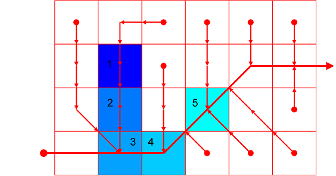

# Including water use

## Introduction

This annex describes the LISFLOOD water use routine, and how it is used.

The water use routine can be used to assess the effect of water withdrawal from different sectors to the water balance. Sectors can be public, industrial, agricultural or energy water withdrawal. As input LISFLOOD needs a stack of maps for one representative year of total water withdrawal demand. According to the available water LISFLOOD calculates if this demand can be fulfilled and removes the possible amount of withdrawal water from the river system. Water use is *optional*, and can be activated by adding the following line to the 'lfoptions' element:

```xml
	<setoption name="wateruse" choice="1" />
```


## Calculation of water use

The water is withdrawn only from discharge in the river network but not from soil, groundwater or directly from precipitation.

-   For each single day a total demand of withdrawal water is loaded from a sparse stack of maps

-   Water use is taken from the discharge in the river network. First the water use is taken from the same grid cell (see figure below -- pixel No. 1)

-   If the amount of water withdrawal is larger than the water available in this grid cell water is taken from downstream moving along the local drain direction. This is done by implementing a loop substracting the remaining water from the next downstream cell till all the water for water use is taken or a predefined number of iteration is reached (see figure below -- pixel No. 2 to 5)



***Figure:*** *Water withdrawal assessing demand and availability along the flow path.*

In the settings.xml you can define:

-   the percentage of water that must remain in a grid cell and is not withdrawn by water use (WUsePercRemain)

-   the maximum number of loops (= distance to the water demand cell). For example in figure above: maxNoWateruse = 5


## Preparation of input data

The following Table gives an overview about the maps and table needed for the water use option.

***Table:*** *Input requirements water use.*                                                                                            

| Maps                           | Default name   | Description                                             | Units           |
| ------------------------------ | -------------- | ------------------------------------------------------- | --------------- |
| Yearly stack of water use maps | wuse0000.xxx   | Total water withdrawal                                  | $\frac{m^3}{s}$ |
| Table                          |                |                                                         |                 |
| WUseofDay                      | WUseofDays.txt | Assignment of day of the year to map stack of water use | -               |


A sparse map stack of one year of total water withdrawal $[\frac{m^3}{s}]$ with a map every 10 days or a month is needed. Because it is assumed that water use follows a yearly circle, this map stack is used again and again for the following years. For example:

```xml
	 t   map name 
	 1   wuse0000.001 
	 2   wuse0000.032 
	 3   wuse0000.060 
	 4   wuse0000.091 
	 5   wuse0000.121 
	 6   wuse0000.152 
	 7   wuse0000.182 
	 8   wuse0000.213 
	 9   wuse0000.244 
	 10  wuse0000.274 
	 11  wuse0000.305 
	 12  wuse0000.335 
```


To assign each day of simulation the right map a lookup table (WUseOfDay.txt) is necessary:

```xml
	 <,0.5> 335    
	 [0.5,32> 1    
	 [32,60> 32    
	 [60,91> 60    
	 [91,121> 91   
	 [121,152> 121 
	 [152,182> 152 
	 [182,213> 182 
	 [213,244> 213 
	 [244,274> 244 
	 [274,305> 274 
	 [305,335> 305 
	 [335,> 335
```


## Preparation of settings file

All in- and output files need to be defined in the settings file. If you are using a default LISFLOOD settings template, all file definitions are already defined in the 'lfbinding' element.

```xml
	<textvar name="PathWaterUse" value="./wateruse">                
	<comment>                                                           
	Water use maps path                                                   
	</comment>                                                          
	</textvar>                                                          
	<textvar name="PrefixWaterUse" value="wuse">                    
	<comment>                                                           
	prefix water use maps                                                 
	</comment>                                                          
	</textvar>                                                          
	<group>                                                             
	<comment>                                                           
	**************************************************************               
	INPUT WATER USE MAPS AND PARAMETERS                                   
	**************************************************************               
	</comment>                                                          
	<textvar name="WaterUseMaps" value="$(PathOut)/wuse">          
	<comment>                                                           
	Reported water use [cu m/s], depending on the availability of       
	discharge                                                             
	</comment>                                                          
	</textvar>                                                          
	<textvar name="WaterUseTS" value="$(PathOut)/wateruseUps.tss"> 
	<comment>                                                           
	Time series of upstream water use at gauging stations                 
	</comment>                                                          
	</textvar>                                                          
	<textvar name="StepsWaterUseTS"                                    
	value="$(PathOut)/stepsWaterUse.tss">                             
	<comment>                                                           
	Number of loops needed for water use                                  
	routine                                                               
	</comment>                                                          
	</textvar>                                                          
	<textvar name="maxNoWateruse" value="5">                        
	<comment>                                                           
	maximum number of loops for calculating the use of water              
	= distance water is taken for water consuption                        
	</comment>                                                          
	</textvar>                                                          
	<textvar name="WUsePercRemain" value="0.2">                     
	<comment>                                                           
	percentage of water which remains in the channel                      
	e.g. 0.2 -> 20 percent of discharge is not taken out                 
	</comment>                                                          
	</textvar>                                                          
	</group>                                                            
```

***PathWaterUse*** is the path to the map stack of water use

***PrefixWaterUse*** is the prefix of the water use maps

***WaterUseMaps*** is the path and prefix of the reported water use $[\frac{m^3}{s}]$ as a result of demand and availability

***WaterUseTS*** are time series of upstream water use $[\frac{m^3}{s}]$ at gauging stations

***StepsWaterUseTS*** is the number of loops needed for water use [-]

***maxNoWateruse*** is maximum number of loops for calculating the use of water (distance water is taken for water consumption)

***WUsePercRemain*** is the percentage of water which remains in the channel (e.g. 0.2 -> 20 percent of discharge is not taken out)


Finally, you have to tell LISFLOOD that you want to simulate water use. To do this, add the following statement to the 'lfoptions' element:

```xml
	<setoption name="wateruse" choice="1" />
```


## Water use output files

The water use routine can produce 2 additional time series and one map (or stack), as listed in the following Table:

 ***Table:*** *Output of water use routine.*     

| Maps            | Default name      | Option          | Units           |
| --------------- | ----------------- | --------------- | --------------- |
| WaterUseMaps    | wusexxxx.xxx      | repwateruseMaps | $\frac{m^3}{s}$ |
| **Time series** |                   |                 |                 |
| Number of loops | stepsWaterUse.tss |                 | -               |
| WaterUseTS      | wateruseUps.tss   | repwateruseTS   | $\frac{m^3}{s}$ |

[🔝](#top)

